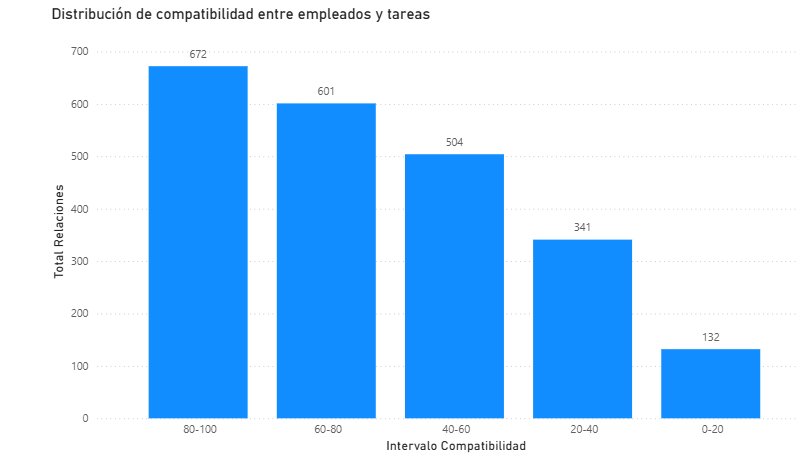
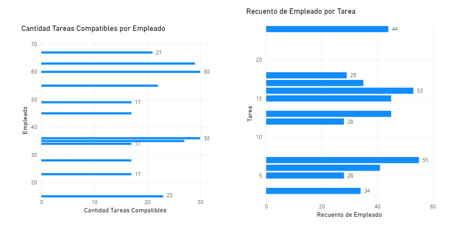
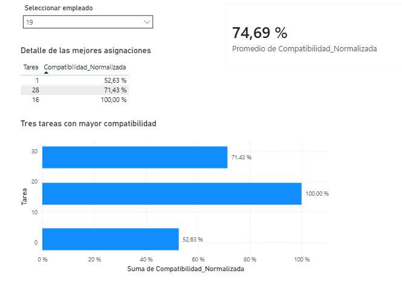

# Sistema de Asignación de Tareas Basado en Compatibilidad

## Introducción

Este proyecto implementa un sistema de asignación de tareas basado en el grado de compatibilidad entre empleados y tareas. A partir de un conjunto de datos generado en Python, se calcula un porcentaje de compatibilidad considerando distintas habilidades ponderadas, se construyen grafos bipartitos para representar las relaciones entre empleados y tareas y, finalmente, se desarrollan informes interactivos en Power BI para facilitar el análisis de los resultados.

El objetivo del proyecto es mostrar un flujo completo de análisis de datos utilizando Python para el procesamiento de la información y Power BI para la visualización, simulando un escenario de asignación de tareas dentro de una empresa.

---

# Objetivos

* Generar un conjunto de datos representativo de empleados y tareas.
* Diseñar una métrica que permita calcular el nivel de compatibilidad entre un empleado y una tarea.
* Modelar las relaciones mediante grafos bipartitos.
* Obtener diferentes perspectivas de análisis aplicando filtros sobre la red.
* Desarrollar un dashboard interactivo que facilite la interpretación de los resultados.

---

# Tecnologías utilizadas

* Python
* Pandas
* NetworkX
* OpenPyXL
* Power BI Desktop
* Microsoft Excel

---

# Estructura del proyecto

```text
task-assignment-graph-analysis/
|
├── dashboard/
│   └── proyecto.pbix
|
├── datasets/
│   ├── empresa.xlsx
│   ├── grafo_completo.xlsx
│   ├── grafo_reducido_80.xlsx
│   └── grafo_top3_tareas_por_empleado.xlsx
|
├── grafos/
│   ├── grafo_bipartito.html
│   ├── grafo_bipartito_reducido_80.html
│   ├── grafo_bipartito_top_3.html
|
├── imagenes/
│   ├── graficohoja1.png
│   ├── graficohoja2.png
│   ├── graficohoja3.png
|
├── src/
│   ├── funciones_proyecto.py
│   ├── menu_proyecto.py
│   └── grafos_proyecto.py
|
└── README.md
```

---

# Metodología

## 1. Generación del conjunto de datos

Como punto de partida se desarrolló un conjunto de datos compuesto por **75 empleados** y **30 tareas**.

Cada empleado posee un nivel de dominio en distintas habilidades, mientras que cada tarea define el nivel mínimo requerido para poder realizarla.

Toda la información fue generada mediante Python y posteriormente exportada al archivo **empresa.xlsx**, que constituye la base de datos utilizada durante todo el proyecto.

---

## 2. Modelo de compatibilidad

Para evaluar qué tan adecuado es un empleado para realizar una determinada tarea se definieron cuatro habilidades fundamentales.

| Habilidad               | Peso |
| ----------------------- | ---: |
| Herramientas técnicas   | 0.10 |
| Inglés                  | 0.20 |
| Trabajo en equipo       | 0.30 |
| Resolución de problemas | 0.40 |

Los pesos representan la importancia de cada habilidad dentro del cálculo de compatibilidad.

Cada habilidad puede tomar un nivel comprendido entre **0 y 4**.

| Nivel | Significado |
| ----: | ----------- |
|     0 | Nulo        |
|     1 | Básico      |
|     2 | Intermedio  |
|     3 | Avanzado    |
|     4 | Experto     |

En el caso de los empleados, el nivel representa el dominio que poseen sobre una habilidad determinada.

En las tareas, el valor representa el nivel mínimo requerido para desempeñarlas correctamente.

---

## Cálculo de compatibilidad

El porcentaje de compatibilidad se obtiene comparando el nivel de cada empleado con los requisitos de cada tarea, considerando además la importancia de cada habilidad mediante los pesos definidos.

La lógica utilizada consiste en comparar cuánto de los requerimientos de una tarea puede cubrir un empleado respecto del nivel ideal necesario para realizarla.

De esta forma se obtiene un valor normalizado entre **0 % y 100 %**, lo que permite comparar empleados para cualquier tarea independientemente de la cantidad o importancia de las habilidades requeridas.

La fórmula para calcular la compatibilidad es la siguiente:

$C={{\sum_{i=1}^4 w_i\cdot min(E_i,T_i)}\over {\sum_{i=1}^4 w_i\cdot T_i}}\times 100$

$E_i$= nivel del empleado.
$T_i$= nivel requerido por la tarea.
$w_i$= peso de la habilidad.

---

## Consulta de compatibilidad

Como primera aplicación del modelo desarrollado se implementó un menú (`menu_proyecto.py`) que permite al usuario ingresar el identificador de un empleado y el identificador de una tarea para obtener el porcentaje de compatibilidad correspondiente.

Esta funcionalidad permite verificar individualmente cualquier relación empleado–tarea generada por el sistema.

---

# Construcción de la red bipartita

Una vez calculadas todas las compatibilidades, se construyeron distintos grafos bipartitos utilizando la biblioteca **NetworkX**.

En estos grafos:

* un conjunto de nodos representa a los empleados;
* el otro conjunto representa las tareas;
* cada arista almacena el porcentaje de compatibilidad entre ambos.

Con el objetivo de analizar la información desde distintas perspectivas se generaron tres grafos diferentes.

## Grafo bipartito completo

Este grafo contiene todas las relaciones posibles entre empleados y tareas.

Cada uno de los **75 empleados** se encuentra conectado con las **30 tareas**, obteniéndose un total de **2250 relaciones**.

Este grafo constituye la representación completa del sistema de compatibilidad y sirve como punto de partida para el resto de los análisis.

> *(Insertar imagen del grafo completo.)*

---

## Grafo de compatibilidades altas

El segundo grafo filtra la red completa y conserva únicamente aquellas relaciones cuya compatibilidad es igual o superior al **80 %**.

Este filtrado permite identificar rápidamente qué empleados resultan adecuados para cada tarea y cuáles son las tareas que cuentan con una mayor cantidad de candidatos compatibles.

> *(Insertar imagen del grafo filtrado.)*

---

## Top 3 tareas por empleado

El tercer grafo selecciona únicamente las tres tareas con mayor porcentaje de compatibilidad para cada empleado.

Esta representación facilita la recomendación de tareas, mostrando aquellas opciones que mejor se ajustan al perfil de cada trabajador.

> *(Insertar imagen del grafo Top 3.)*

---

# Visualización en Power BI

Para complementar el análisis se desarrolló un dashboard interactivo utilizando Power BI Desktop.

Cada uno de los datasets generados mediante Python fue utilizado para construir distintas visualizaciones.

## Hoja 1 — Distribución de compatibilidades

La primera hoja utiliza el conjunto de datos correspondiente al grafo completo (`grafo_completo.xlsx`).

Incluye un gráfico que muestra la cantidad de relaciones empleado–tarea agrupadas por intervalos de compatibilidad (0–20 %, 20–40 %, 40–60 %, 60–80 % y 80–100 %).

Esta visualización permite conocer cómo se distribuyen todas las compatibilidades calculadas por el sistema.



---

## Hoja 2 — Compatibilidades altas

La segunda hoja utiliza únicamente las relaciones con compatibilidad mayor o igual al 80 % (`grafo_reducido_80.xlsx`).

Se presentan dos gráficos principales:

* empleados con mayor cantidad de tareas altamente compatibles;
* tareas con mayor cantidad de empleados capaces de realizarlas.

Estas visualizaciones permiten identificar perfiles versátiles y tareas con amplia disponibilidad de personal.



---

## Hoja 3 — Recomendación por empleado

La tercera hoja está orientada al análisis individual a partir del conjunto de datos filtrado (`grafo_top_3_tareas_por_empleado.xlsx`).

Mediante un **segmentador (Slicer)** el usuario puede seleccionar un empleado y visualizar automáticamente:

* sus tres tareas con mayor compatibilidad;
* un gráfico de barras con dichas tareas;
* la compatibilidad promedio obtenida.

Esta vista funciona como una herramienta sencilla de recomendación de tareas basada en los resultados obtenidos por el modelo de compatibilidad.



---

# Resultados

El proyecto permitió desarrollar un flujo completo de procesamiento y análisis de datos:

* generación de un conjunto de datos sintético;
* cálculo automático de compatibilidades;
* construcción de grafos bipartitos;
* filtrado de relaciones relevantes;
* recomendación de tareas por empleado;
* desarrollo de un dashboard interactivo para la exploración de los resultados.

En conjunto, estas etapas muestran cómo combinar herramientas de análisis de datos y teoría de grafos para resolver un problema de asignación de tareas de forma clara e interpretable.

---

# Posibles mejoras

El proyecto puede ampliarse de diversas maneras:

* incorporar nuevas habilidades y criterios de evaluación;
* permitir que los pesos de las habilidades sean configurables por el usuario;
* utilizar bases de datos SQL en lugar de archivos Excel;
* desarrollar una interfaz gráfica para facilitar la interacción con el sistema;
* desplegar la aplicación como una solución web.

---

# Franco Palacios

Proyecto desarrollado como parte de un portfolio orientado al análisis de datos, Python, teoría de grafos y Power BI.
